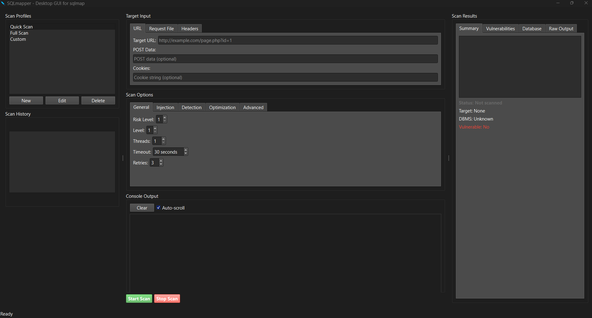
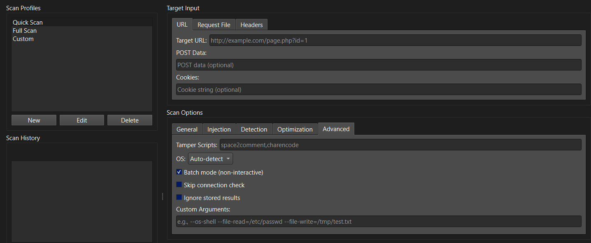
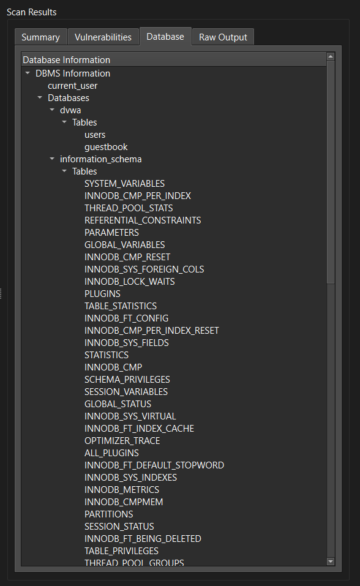

# SQLmapper

<div align="center">

```
                  _____  _____  __     _____  _____  _____  _____  _____  _____  _____ 
                 |   __||     ||  |   |     ||  _  ||  _  ||  _  ||  _  ||   __|| __  |
                 |__   ||  |  ||  |__ | | | ||     ||   __||   __||   __||   __||    -|
                 |_____||__  _||_____||_|_|_||__|__||__|   |__|   |__|   |_____||__|__|
                           |__|          GUI Version of SQLMap
```

**SQLmapper** is a professional desktop GUI application for sqlmap, similar to how Zenmap is a GUI for nmap. It provides a clean, beginner-friendly interface to run and manage sqlmap scans.

[](https://www.python.org/downloads/)
[](https://opensource.org/licenses/MIT)
[](https://github.com/heshamm1/sqlmapper)

</div>

## ⚠️ Legal Disclaimer

**SQLmapper is a tool for authorized security testing only.**

By using this software, you agree to:
- Only test systems you own or have explicit permission to test
- Comply with all applicable laws and regulations
- Use the tool responsibly and ethically

The developers are not responsible for any misuse of this tool.

## 🚀 Quick Start

```bash
# Clone the repository
git clone https://github.com/heshamm1/sqlmapper.git
cd sqlmapper

# Run the automated installer
python setup.py

# Launch the application
python app.py
```

The installer will automatically:
- ✅ Detect your operating system (Windows, Linux, macOS)
- ✅ Check for Python 3.8+ compatibility
- ✅ Install SQLMap if not found
- ✅ Install all Python dependencies
- ✅ Create launcher scripts
- ✅ Configure the application

## 🎯 Features

- **Target Input**: Support for URLs, request files, headers, and cookies
- **Scan Profiles**: Pre-configured profiles (Quick Scan, Full Scan, Custom)
- **Options Panel**: Comprehensive configuration for risk/level, proxy, auth, timeout, etc.
- **Real-time Console**: Live output streaming from sqlmap
- **Results Panel**: Display detected DBMS, injectable parameters, and findings
- **Cross-Platform**: Works on Windows, Linux, and macOS
- **Auto-Installation**: Automatically installs SQLMap if not found

## 📸 Screenshots

<div align="center">

### Main Interface


### Scan Options


### Results Display


</div>

## 🏗️ Project Structure

```
sqlmapper/
├── app.py                 # Main application launcher
├── setup.py              # Installation and setup script
├── requirements.txt       # Python dependencies
├── README.md             # This file
├── LICENSE               # MIT License
├── sqlmapper/            # Main package
│   ├── gui/             # GUI components
│   │   ├── main_window.py
│   │   └── components/  # UI components
│   ├── core/            # Core functionality
│   │   ├── command_builder.py
│   │   └── subprocess_runner.py
│   ├── utils/           # Utilities
│   │   ├── config.py
│   │   └── logger.py
│   └── assets/          # Application assets
└── logo.ico             # Application icon
```

## 🛠️ Development

### Setting up Development Environment

```bash
git clone https://github.com/heshamm1/sqlmapper.git
cd sqlmapper
python -m venv venv
source venv/bin/activate  # On Windows: venv\Scripts\activate
pip install -r requirements.txt
pip install -e .
python app.py
```

### Building Executables

```bash
pip install pyinstaller
pyinstaller --onefile --windowed --icon=logo.ico app.py
```

## 📄 License

This project is licensed under the MIT License - see the [LICENSE](LICENSE) file for details.

## 🙏 Acknowledgments

- [sqlmap](https://github.com/sqlmapproject/sqlmap) - The underlying SQL injection tool
- [PySide6](https://pypi.org/project/PySide6/) - Qt for Python
- [Zenmap](https://nmap.org/zenmap/) - Inspiration for the GUI approach

---

<div align="center">

**Made with ❤️ for the security community by heshamm1**

[Report Bug](https://github.com/heshamm1/sqlmapper/issues) • [Request Feature](https://github.com/heshamm1/sqlmapper/issues)

</div>
